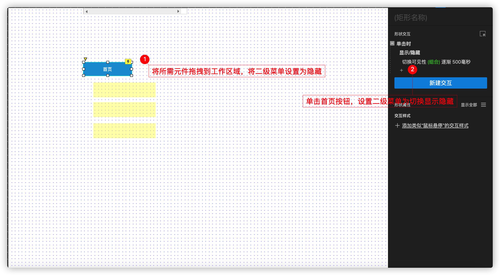

## Axure的基本功能

### 1.原型介绍

>原型（prototype）这个词来自拉丁文的词proto，意谓“最初的”，意义是形式或模型。在非技术类的文中，一个原型是给定种类的一个代表性例子。
>在这里我们主要讲的是软件原型，在软件开发中，一个原型是产品或数据系统的一个基本的实用模型。
>软件原型包含但不限于：功能、交互、UI。

软件开发工程中原型的地位：便于快速沟通、确定明确需求

### 2.Axure介绍

>Axure RP是一款专业的快速原型设计工具。Axure（发音：Ack-sure），代表美国Axure公司；RP则是Rapid Prototyping（快速原型）的缩写。
>Axure RP的使用者主要包括商业分析师、信息架构师、产品经理、IT咨询师、用户体验设计师、交互设计师、UI设计师等，另外，架构师、程序员也在使用Axure。
>Axure RP Pro能快速帮助设计者设计出快捷而简便的创建基于网站构架图的带注释页面示意图、操作流程图、以及交互设计，并可自动生成用于演示的网页文件和规格文件，以提供演示与开发。
>优势：
>Axure这个软件功能强大，可以做出很多交互效果，直接通过拖拽画出原型、生成网页；
>Axure这个软件效果高，只有遵循一些可用性原创，很快模拟出高保真页面原型。

Axure中文学习网：https://www.axure.com.cn/

通过打开Axure软件，原型文件后缀名是*.rp。通过后续的教学可以梳理出以下要点：当与甲方沟通时，可以有以下三种方式：

* *.rp文件
* 菜单栏-文件-导出图片
* 菜单栏-发布-生成HTML文件

汉化包下载地址：http://www.chanpinban.com/downloads/##

.png)

### 3.菜单栏

.png)

其中，经常使用的菜单功能有：

* 文件-导出图片：当前打开页面对应的单张图片、所有页面
* 编辑-快捷键：保存、撤销
* 视图-重置视图：当关闭某个窗口，可通过此次菜单快速恢复窗口视图
* 布局-组合、对齐、分布，在工具栏也有快速按钮，包含shift键多选元件、组合后右键或者概要中进行重命名
* 布局-显示网格和对齐辅助线
* 发布-预览、预览选项、生成HTML文件，在工具栏也有快速按钮

### 4.工具栏

.png)

工具栏中基本工具有一些是菜单栏中的快速按钮，样式工具是功能设置中的样式。其中特殊的有：

* 缩放，也可Ctrl和+或者-进行放大或者缩小
* 连接线

对两个元件进行连接，有自动聚焦功能，且连接线可进行设置：线条颜色、线条粗细、线条样式、箭头样式。根据不同的业务进行对应的连接线设置。

.png)

* 钢笔工具

1.双击或者esc结束钢笔工具

2.画直线、折线

3.画曲线：当前点位置左键鼠标按住不动，方向影响到曲线的方向，橘色的线长度影响到曲线的半径

4.样式：线条（颜色、粗细、样式）、填充（单色、渐变）

.png)

### 5.页面：导航视图、概要

>页面是项目页面的导航面板, 在这里面可以对所有设计的页面进行添加、删除、重命名和组织等。

页面视图要有项目结构，便于管理。概要是针对一个页面中所有元件的浏览与设置。

.png)

### 6.元件库

> 组件面板中包括有线框图组件和流程图组件两种类型，用这些组件可以进行线框图和流程图的相应设计。
> 这里显示的是所有的组件，后面的一部分是流程图组件 。系统默认显示的线框图类型的部件。

- #### Default

可以将要使用的组件拖拽到工作区域进行使用

.png)

##### 案例1：form表单

.png)

.png)

.png)

- #### flow

主要用于UML、ER、流程图等设计使用

.png)

- #### icons

1.可以使用Axure自带icon图标

.png)

2.还可以使用iconfont图标库里的图标

使用iconfont图标需要在google浏览器中安装axhub插件，安装完成后，直接复制自己喜欢的图标即可

.png)

打开iconfont，使用插件复制即可

.png)

.png)

- #### Load Libraries

Axure自带的元件有时并不能满足我们的设计需求，所以市面上许多前端组件库提供了相对应的Axure元件库供给设计师使用。

常用的有elementUI，vant，antDesign等

将下载好的元件库导入到Axure中即可

.png)

.png)

#### 7.母版

作用：风格的统一、元件的复用

新建母版：已有元件，右键生成母版

左下角新建母版

使用：从左下角拖拽使用

行为方式：任意位置、固定位置

只要修改母版，每个页面的引用的母版内容就会改变

#### 8.自适应

可以根据窗口的分辨率自动调整页面样式。我们需要在页面属性中开启自适应：

#### 9.交互

>交互类型
>Axure里的交互动作大致包括：定义链接、设置动作、多个条件场景、页面上的交互四种类型

交互样式(仅对当前元件的样式进行更改)：选中元件，鼠标右键，选择【交互样式...】，选择交互触发类型，选择要更改的交互样式。

交互动作(带有逻辑性)：选中元件，在右侧交互面板选择交互事件类型，设置动作。

交互情形(带有逻辑性)： 设置交互动作，在交互动作中添加情形并设置情形对应的动作；当某个元件的值满足A情形的时候做A动作，满足B情形的时候做B动作。

##### 案例2 页面载入时，弹出欢迎语或欢迎图片等

> 定义链接
> 定义链接可以让一个组件响应一个动作时（如鼠标点击、飘过）链接到其他页面。
> 在Axure里提供了四种链接方式：
> 1、链接到设计中的页面；
> 2、连接到外部网址或文件；
> 3、重新载入当前页面；
> 4、返回上个页面。

> 设置动作
> 除了定义链接之外，Axure里还可以设置丰富的动作，在Axure里，任何可以触发的事件中都可以执行这些动作。

##### 案例3   选项组菜单互斥效果

.png)

.png)

##### 案例4 折叠菜单

